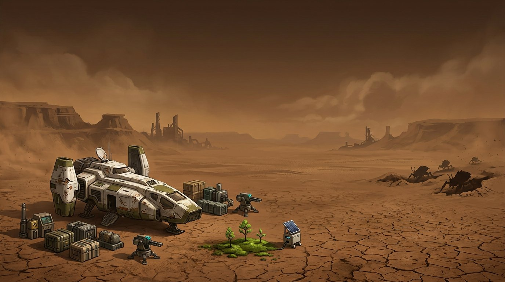

# Second Nature · Last Landing
### A stable Factorio 2.0 / Space Age planetary-restoration overhaul

**You can build another rocket. First, give this world a reason to live.**

Your expedition lands on a stripped, smog-filled Nauvis. The descent engine is spent. The lander holds emergency equipment; two loaded turrets cover the camp. There are no natural forests or fish. Only the broods remain—and the pollution blanket that sustains their tolerance of your industry.

Build mineral biology, close your waste loops, restore five worlds and defend the machines that bring life back. Dirty industry buys temporary calm, not a healthy planet. When Nauvis finally recovers, decide whether its natives should become peaceful flowering life or disappear.

**v0.2.0 alpha · stable 2.0.77 · 22 production/monitor machines · 88 recipes · 20 technologies · 3 new sciences · 5 planets**

## Download and install

### [Download Second Nature 0.2.0 for stable Factorio 2.0](https://github.com/Radukan/FC-Test/releases/download/v0.2.0-factorio-2.0/second-nature_0.2.0.zip)

[Release notes and SHA-256 checksum](https://github.com/Radukan/FC-Test/releases/tag/v0.2.0-factorio-2.0). **This repository is private: sign in to GitHub with repository access before downloading.** Do not install the automatically generated “Source code” archives.

1. Use **Factorio 2.0.77** with **Space Age**, **Quality** and **Elevated Rails** enabled.
2. Back up saves. Replace the old Second Nature ZIP/source folder with **`second-nature_0.2.0.zip`**, still zipped, in your `mods` folder.
3. For the intended campaign, start **new Space Age freeplay** and select **Second Nature / Last Landing** in the map presets.
4. Leave **Desolate Nauvis landing**, **Pollution-fed Nauvis broods** and the other default mod settings enabled. Keep pollution enabled in the map settings.
5. Press **Shift + T** or the leaf shortcut for the field station. **Ctrl + Shift + P** toggles the local smog overlay.

Windows: `%APPDATA%\Factorio\mods` · Linux: `~/.factorio/mods` · macOS: `~/Library/Application Support/factorio/mods`.

**Stable only from 0.2 onward.** Experimental 2.1 builds are discontinued. A fresh save is required for the new landing and barren map generation. Upgrading an existing 0.1 save preserves its factories, ecological values and terrain: it does **not** erase forests or grant another lander.

## What changed in 0.2

- **Dashboard crash fixed.** All named GUI children are prefixed; `tabs`, `value`, `text`, `state` and other engine member names cannot collide. The runtime test double now rejects those names. A failed dashboard construction is caught instead of terminating the factory.
- **Real-engine fixes.** Monitor registration no longer calls crafting-only APIs on a constant combinator. Runtime utilities are loaded explicitly, and module imports happen during control parsing, not event callbacks. The special built-in default map preset is left structurally intact.
- **Last Landing.** A shared cargo lander, a short arrival camera pan, two preloaded turrets and starter wall segments. No starting platform or orbital teleport. Build and launch a normal Nauvis rocket; afterward the hull becomes salvageable.
- **Desolate Nauvis.** No generated trees/fish, barren earth in place of fresh grass, and configurable legacy smog. Ores, rocks, cliffs and water remain.
- **Inverted Nauvis pressure.** Pollution-driven biter attack recruitment/evolution is replaced by restoration-driven raids. Actual local pollution suppresses warnings, reduces wave size and can send tracked raiders home.
- **Air & natives.** Planet-wide pollution inventory, trend, rolling hotspots, local reading, a private local overlay and two new circuit outputs.
- **Pollution gates life.** Dirty local air blocks soil/biodiversity bonuses; global contamination constrains biodiversity and prevents final planetary completion.
- **A visible recovery front.** Early gardens stay near machines. Living Nauvis gradually greens across generated chunks, with sparse trees, browning under heavy smog, and reversible water discoloration.
- **A permanent native choice.** Symbiosis brings original, animated **Bloomback grazers** and flowering gardens. Eradication removes native populations. Both policies cover existing and subsequently discovered colonies.
- **Menu presentation.** The original Last Landing illustration replaces vanilla menu simulations, with a startup option to restore the vanilla menu.

## The landing economy

The lander is one shared grant **per force**, not per player/reconnect. Its hull initially cannot be mined or destroyed. Cargo includes:

| Supplies | Starting quantities |
|---|---|
| Bulk materials | 200 iron plates, 100 copper plates, 40 steel, 120 stone, 160 coal, 40 wood |
| Factory components | 40 gears, 40 circuits, 100 belts, 20 inserters, 20 small poles, 40 pipes |
| Production and power | 4 burner drills, 6 stone furnaces, 1 offshore pump, 1 boiler, 2 steam engines |
| Reserve defense | 100 magazines, 20 repair packs, 40 walls |
| Deployed defense | 2 gun turrets with 75 magazines each; 10 short wall segments |

If terrain prevents placing a defensive item, it is retained in the lander cargo instead.

Each crew member starts with a pistol and 20 magazines. Use the poles and finite wood carefully; the biological bootstrap needs **no natural tree or seed**. Timber cultivation provides renewable wood later. Resources are not limitless, and the camp is not an instant automated factory.

### First steps

1. Recover the lander cargo. Establish mining, smelting, water and steam power; keep turrets loaded.
2. **Stone → silica → glass.** Silica is hand-craftable. Red science also needs glass in overhaul mode.
3. **Pioneer biology → nutrients → culture → algae.** Supply water and electricity.
4. **Compost, biochar and living substrate.** Green science also consumes compost.
5. **Soil station → ecological samples → ecology science.** Samples still emerge when smog blocks the living-soil bonus, so the cleanup technology is not locked behind clean air.
6. Supply **scrubbers** and clear the local chunk to **≤ 10** pollution before expecting living-soil and biodiversity gains. Buffer early waste until closed-loop processing is unlocked.
7. Expand into watersheds, forests, thermal balancing and detoxification. Defend your cleanup perimeter before removing the smog that was calming nearby broods.

## Pollution: a real compromise

### Global versus local

The **global** inventory comes from Factorio's `get_total_pollution()` and covers the **whole surface**, including uncharted and pollution-only engine chunks—not only the area around registered machines. The hotspot survey covers fully generated terrain. Totals refresh roughly every ten seconds. A bounded survey visits **four chunks per second total**, shared between visited worlds, to report hotspots.

The **local** reading is pollution in the chunk at your current position. The optional overlay covers a 5 × 5 chunk neighborhood:

- **Green: ≤ 10** — local living growth is possible.
- **Amber: > 10** — soil/biodiversity bonuses are blocked.
- **Magenta: ≥ 200** — heavy contamination, sufficient to suppress a Nauvis restoration raid at its target or supporting nest.

Use the map's native pollution display for a wider spatial view. The overlay never generates terrain or reveals a fake infinite planet.

### Why biters attack green industry

With **Pollution-fed Nauvis broods** enabled, Nauvis nests no longer absorb pollution to recruit attack parties, and ordinary pollution no longer drives evolution. Scripted raids choose **recently productive clean restoration installations**, never dirty retorts or forcing towers.

A raid still requires a **real nest 96–512 tiles away**, gives **45 seconds of warning**, and respects peaceful mode and diplomacy. Balanced settings provide **20 minutes of grace after first ecological work**, an **eight-minute cooldown**, a **40-unit maximum** and at most **three tracked groups per world**. Clean progress sets a lower bound on scripted wave strength. Pentapod groups are smaller.

Pollution reduces effective pressure and wave size. At 200 units in the target or nest chunk, a warned wave is suppressed. A tracked wave whose target becomes heavily polluted turns back. But pollution is **not invulnerability**: proximity aggression, retaliation, territorial expansion and obstruction combat still exist. Gleba retains ordinary spore behavior; pollution does not soothe pentapods.

Dirty processing also creates toxic debt and physical waste. You must dismantle, clean up or contain that compromise to finish the planet.

## Restore a world, then choose its native future

Every world has five **0–100 fitness scores**: atmosphere, thermal balance, water, soil and biodiversity. Toxicity limits recovery. These are ecological suitability scores, **not rewrites of the engine's pressure, temperature or heating mechanics**.

Stages progress from **Hostile → Conditioned → Rooted → Recovering → Living → Self-sustaining**. Final status requires:

- Every fitness axis **≥ 90**.
- Toxicity **≤ 8**.
- Measured planetary pollution/spores **≤ 500**.
- A completed rolling survey with peak chunk pollution **≤ 10**.

After **two uninterrupted clean minutes** at Nauvis stage 5, the **Air & natives** tab offers a two-step, irreversible choice:

| Symbiosis | Eradication |
|---|---|
| Biters/spitters become peaceful **Bloombacks**, with original eight-direction walking sprites. Nests and worms become flowering gardens. | Biters, spitters, worms and nests are removed. Their former habitat is free for construction. |
| Friendly to every force; no attack damage or expansion. Living gardens retain space on the map. | No imported replacement enemies or forced return of the broods. |

A one-time entity index and bounded workers handle existing populations, including moving units. Chunk and spawning events enforce the policy on later colonies. The choice affects **Nauvis only**. Multiplayer requires an administrator, because ecology is shared. Optional pre-game mod settings can choose an automatic outcome instead.

Neither choice makes future pollution harmless. A neglected restored factory can still damage its ecology. “Planetary restoration” manages generated territory and its restoration network; it does not pretend to paint every tile of an infinite, ungenerated world instantly.

## Five worlds remain distinct

| World | Restoration specialty | What remains dangerous |
|---|---|---|
| **Nauvis** | Mineral bootstrap, legacy smog cleanup, forests and the native choice | Brood response to greening |
| **Vulcanus** | Basalt weathering and exported thermophiles | Lava and demolisher territories |
| **Fulgora** | Scrap/heavy-metal remediation and holmium biocatalysts | Lightning, islands and oil seas |
| **Gleba** | Symbiotic cultures and balanced spores | Spoilage, crop-soil logistics and pentapods |
| **Aquilo** | Heated cryogenic gardens and imported biodiversity | Heat, ice support and interplanetary supply chains |

Vulcanus, Fulgora and Aquilo retain the ordinary pollution layers introduced in 0.1; Gleba keeps spores. No arbitrary biter invasions are introduced on those three worlds.

**Campaign victory:** research Second Nature, keep all five planets self-sustaining, and supply your force's Gaia beacon on every world for **ten uninterrupted minutes**. Each beacon needs a completed cycle at least every **90 seconds**. Interrupted conditions reset the hold. Continue building after victory.

## Controls and safety

| Control | Function |
|---|---|
| **Shift + T**, leaf shortcut, `/second-nature` | Field station, air survey, native choice and six-topic field guide |
| **Ctrl + Shift + P**, smog shortcut | Toggle the private local smog overlay |
| **Ecology monitor** | 11 signals: five fitness axes, toxicity, resistance, stability, stage, global pollution and local pollution |
| `/sn-status` | Read-only status report |
| `/sn-reindex` | Administrator-only reconciliation; does not reset ecology or issue new cargo |

Preset alternatives: **Brood Frontier** (denser colonies, smaller starting area) and **Quiet Reclamation** (peaceful engineering campaign).

- Idle, unpowered, frozen, output-blocked or ingredient-starved machines earn no completed-craft benefits.
- Terrain workers preserve ore, paving, buildings, ghosts, foundations, crop soils, lava and Aquilo support ice. Nauvis water recoloring swaps only ordinary/green variants, not collision/support types.
- The first combinator section is reserved for telemetry and never shares a named group across worlds.
- Other total overhauls, alternative starting planets and custom victory scenarios are not certified integrations.
- **Before uninstalling:** disable **Network victory**, save, then remove the mod. Removing it can still delete modded items/entities; restored terrain and an already executed native choice are not undone.

## Verification and development

The [verification ledger](docs/VERIFICATION.md) distinguishes source/mocked tests, actual headless checks and untested graphical/full-campaign behavior. **This is still an alpha**, not a claim of a fully balanced or multiplayer-certified campaign.

- [Campaign design](docs/DESIGN.md)
- [Complete recipes, machines, materials and research](docs/CATALOG.md)
- [Balance equations and budgets](docs/BALANCE.md)
- [Supplied-kit model simulation—not playthrough time](docs/SIMULATION.md)
- [Development, stable-engine smoke tests and release workflow](docs/DEVELOPING.md)

Build the stable ZIP with `python3 tools/package.py` (Python 3.11+, standard library only). Packages and game binaries stay out of Git; GitHub Releases host the ZIP and checksum.

**License:** MIT for project code and original assets. Production machines/lander reuse installed Factorio assets, not redistributed Wube graphics. The menu is an original AI-assisted illustration; Bloomback sprites and gardens are original procedural artwork, not game screenshots.
