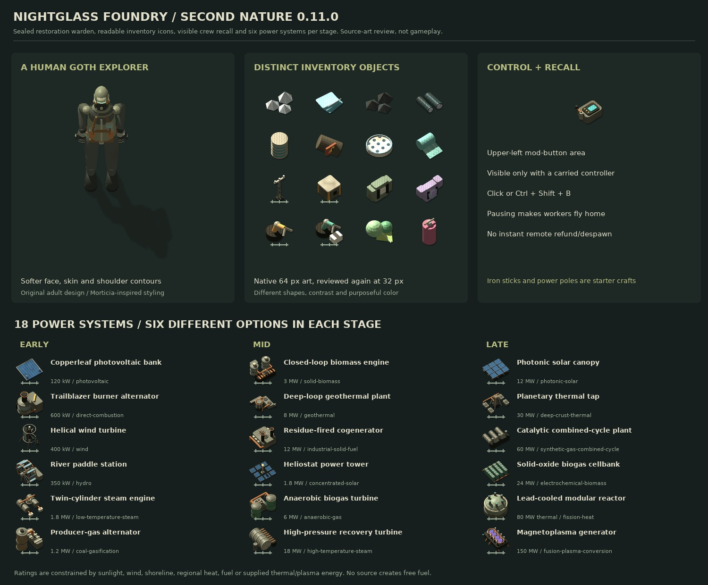

# Second Nature · Restoration Record
### Stable Factorio 2.0 / Space Age restoration overhaul · v0.11.0 alpha

**An intact landing craft. A stripped planet. A factory built to bring life back.**

Nauvis has no natural trees or fish in a fresh campaign. The broods tolerate your pollution - but resist the machines that clean their world. Establish a wood-free factory, defend the expedition and restore five distinct planets. Recovery is measured in sustained industrial work and hours of ecological succession, not a fast green repaint.

## Download

### [Second Nature 0.11.0 - stable Factorio 2.0](https://github.com/Radukan/FC-Test/releases/download/v0.11.0-factorio-2.0/second-nature_0.11.0.zip)

[Release notes](https://github.com/Radukan/FC-Test/releases/tag/v0.11.0-factorio-2.0) · [SHA-256 checksum](https://github.com/Radukan/FC-Test/releases/download/v0.11.0-factorio-2.0/second-nature_0.11.0.zip.sha256)

Download **`second-nature_0.11.0.zip`** and put it directly in your Factorio `mods` folder. **Do not extract it.** Back up saves and remove older Second Nature copies first. Use the named mod ZIP, not GitHub's automatic source archive. This private repository requires GitHub sign-in with repository access.

This release replaces the player character with the sealed **Restoration Warden** and cuts the download from 114.1 MB to **68.7 MB** without reducing any sprite's resolution or frame count. The 0.10.0 industry, the 0.9.0 milestones and field guide, the 0.8.0 power roster, the 0.6.x field crews and all prior restoration content remain included.

1. Use **Factorio 2.0.77**, **Space Age**, **Quality** and **Elevated Rails**.
2. Back up saves and replace older Second Nature ZIP/source copies with `second-nature_0.11.0.zip`, still zipped, in the Factorio `mods` folder.
3. For the complete opening, start new Space Age freeplay with **Second Nature / Last Landing** and the default mod settings. **Brood Frontier** and **Quiet Reclamation** offer harder/peaceful alternatives.
4. **Shift + T / leaf:** field station. **Ctrl + Shift + P:** smog. **Shift + I:** inserter vectors. **Ctrl + Shift + J:** jukebox. **Ctrl + Shift + B / upper-left controller button:** field drones.

Windows: `%APPDATA%\Factorio\mods` · Linux: `~/.factorio/mods` · macOS: `~/Library/Application Support/factorio/mods`.

Stable only; experimental 2.1 builds are discontinued. Existing stable saves retain their factories, ecological values and terrain. They do **not** receive another cargo grant or a replacement defense kit. New habitat-readiness rules can temporarily demote an older mature world while its landscape is surveyed/recovered.

## Restoration Warden 0.11.0

The player character has been rebuilt from scratch, and the mod is now a third smaller.

### A character that belongs in this mod

Second Nature is about working inside a poisoned atmosphere. The new character is a **sealed restoration warden**: hooded work parka, full-face respirator with cheek filters, an emissive visor band and a back hopper of graded seed stock. Nothing renders bare skin, because nothing should be breathing that air. The previous explorer model, its rig and all twenty-four of its atlases are deleted.

Each armour tier is a distinct appearance rather than a recolour. **Field gear** is olive drab with oxidised copper fittings. **Expedition gear** is slate green with teal, and adds a pauldron and a second canister. **Bastion gear** is cold blue-grey with pale cyan, both shoulder plates, upper plating, a reinforced hood crown and a helmet lamp.

The skeleton, poses, frame counts, eighteen-row armed layout, pickaxe grip contract and 1.58-tile height are unchanged, so locomotion, aiming and mining behave exactly as before. The startup toggle still restores the vanilla character.

### 114.1 MB to 68.7 MB

Sprite data was 94% of the download. Every optimisation candidate was measured on the mod's own art rather than assumed, and two of the obvious ones turned out to be traps: cropping the transparent padding around the character sheets returned **0.3-1.4%**, because empty alpha already compresses to nothing, and resampling by a non-integer factor made files **three times larger** by turning 7,000 colours into 40,000 colours of interpolation noise.

What actually costs bytes is colour variety. Sprites are now quantised in colour while **every alpha channel is copied back verbatim**, so antialiased silhouettes and cast shadows are bit-identical and only invisible colour precision is spent - measured error on visible pixels is under 1.2 of 255. A lossless `oxipng` pass follows. **No sprite lost a single pixel of resolution, a frame, or a turret direction.**

The warden is authored for the same goal: ten flat tones per tier, broad uninterrupted panels, and a rasterizer finish that omits the fine surface grain that is invisible at character scale but very expensive to encode.

See [WARDEN.md](docs/WARDEN.md) and [ASSET-SIZE.md](docs/ASSET-SIZE.md).

## Machine Age 0.10.0

Seventeen new industrial buildings, and a rule they all obey: **none of them is a strict upgrade of a vanilla machine.** Second Nature is meant to sit alongside Factorio's industry, not delete it, so every addition trades something real and a mature factory ends up running stock, clean and dirty machines side by side.

### Two furnace families that disagree

Sealed crucibles, oxygen-blown smelters and an electric arc refinery capture their own flue gas and emit almost nothing, but they smelt more slowly per ore and need an oxygen supply. Coke blast furnaces and reverberatory cupolas are cheap, roughly twice as fast on raw ore, and pour emissions and toxicity into the world the restoration model is scoring. Smelting dirty while you bootstrap is the correct opening. Leaving it that way is what stalls your stages.

Captured flue gas is not free either: catalytic flue treatment turns it into activated carbon and a poisoned mesh you then have to reclaim.

### Ore concentration as a factory project

A wet ore mill grinds ore into pumpable slurry, a froth flotation bank floats the valuable mineral off and drops the rest as tailings, and a dewatering press squeezes froth into dry concentrate while handing most of the water back. Smelted in an oxygen-blown smelter, that returns about **2.8 plates per original ore** against 1.0 for direct smelting.

It is deliberately not a research unlock that quietly doubles your output. It is three buildings, a water loop, an oxygen feed, a solid byproduct and roughly 2 MW before the first extra plate appears.

### Mining and research sidegrades

The electric auger and hydraulic mining head produce **no pollution at all** and never out-mine a stock drill. The deep core drill is genuinely faster and reaches further, and it pays with emissions, 3.5 MW and a seven-tile footprint. The field laboratory researches at 1.6x and draws more than five times a stock lab's power, accepting every science package the stock lab does.

### Cleaning up after yourself

Electrostatic smog precipitation removes 180 pollution a cycle and a direct air capture tower removes 520, the strongest cleanup in the mod. Both consume real catalysts, water and oxygen and leave residue to treat. Cleanup is a legitimate strategy. It is never the cheap one.

### Fixes and art

Power pole wires now attach to the insulators the pole sprite actually draws. Copper had been using the inherited vanilla attachment point, leaving every wire floating about half a tile above the pole.

The character was reduced to a vanilla character height. The body rendered about 1.95 tiles tall, roughly 25 percent oversized next to stock characters and machines, and now stands at 1.58. The 0.11.0 warden keeps that corrected height.

Placeable buildings now carry a baseplate rule in their inventory icon, so they no longer read as interchangeable with loose materials.

## Restoration Record 0.9.0

Nothing in this release changes a recipe, a research cost, a power rating or an ecological rate. It adds the three things a finished restoration campaign was still missing: a record of what you achieved, a way to learn the mod inside the game, and a factory you can hear.

### Nineteen milestones

The achievement window now tracks the restoration. **Twelve medallions are evaluated by the mod**, because the engine knows nothing about succession stages, captured spores or a five-world network hold: first breath, root systems, a living world, new growth, terraformer, deep green, signal restored, common ground, quiet eden, hold the line, field stations and second nature.

**Seven more are native condition prototypes** the game judges by itself: first gust, network nodes, coordination cells, matrix gardener, read the world, no shortcuts, and nightglass grid, which needs 100 GJ inside an hour with no emitting generator on the grid.

These are modded achievements in Factorio's separate modded list, so nothing here touches vanilla or Steam progress. Awards belong to a **force**, not to whoever happened to be online: a planetary medal reaches every force with recorded work on that world, an offline player receives it on joining, and merged forces keep the earlier award time. A **Milestones** tab in the field station greys out what is still locked and shows how long ago the rest was earned.

[Medallion sheet](docs/art/achievement-review.jpg) · [Milestones, field guide and soundscape](docs/MILESTONES.md)

### An in-game field guide

**Eleven entries** were added to the native tips-and-tricks window in their own Second Nature category, covering the briefing, starting from stone instead of wood, your first restoration cycle, byproducts as real inventory, the hotspot survey gate, the two kinds of native pressure, circuit telemetry, the eighteen power systems, the solar railway, field crews without a robot network, and finishing the network. They offer themselves when they become relevant, and no stock Factorio tip is replaced, reordered or hidden.

### The factory has a voice

**Sixteen of the eighteen generating plants used to run silently.** Every one now has a working sound picked by mechanism, so plants that work the same way sound the same way: photovoltaic, wind, hydro, combustion, heavy engine, steam, turbine, gas turbine, deep earth, electro and telemetry layers. Loops scale with real output, so a becalmed turbine, a solar bank at midnight and a starved generator fall quiet instead of droning.

**95 carried items** were missing inventory handling audio and now have move, pick and drop sounds matched to their material family. Every referenced sound is a stock base or Space Age asset; nothing is copied into this mod, and a test proves each path is genuinely used by an upstream prototype.

## Nightglass Foundry 0.8.0 corrections

**Iron sticks are craftable from the start**, including in existing saves after the update. Wood-free power poles no longer depend on green science.

The **field-drone button is in the upper-left mod-button area**, not the toolbar, and appears only while the character carries a field controller. Click it or press **Ctrl + Shift + B**. **Pausing recalls drones visibly**: workers keep flying back with their cargo and return to inventory only when they reach the player. Re-enabling does not delete a returning crew. Immediate reconciliation remains limited to lifecycle cases such as death, logout or changing surfaces.

This described the explorer model that 0.11.0 removed. The character is now the sealed Restoration Warden; see [WARDEN.md](docs/WARDEN.md).

**117 inventory/building icons** now have individually authored silhouettes and clearer contrast, reviewed at Factorio's native 64 px and 32 px inventory sizes. Armor icons are actual armor, inserters show their arms, glass is not a rock, depleted components do not look full, and fuel/fluid families use different objects rather than near-identical vials.

### Six power options in every stage

| Stage | Six distinct systems |
|---|---|
| **Early** | Copperleaf photovoltaic bank (120 kW), Trailblazer burner (600 kW), wind turbine (up to 400 kW), river paddle (350 kW), twin-cylinder steam (1.8 MW), producer-gas alternator (1.2 MW) |
| **Mid** | Biomass engine (3 MW), geothermal wellfield (up to 8 MW), residue cogenerator (12 MW), heliostat tower (1.8 MW), biogas turbine (6 MW), high-pressure steam recovery (18 MW) |
| **Late** | Photonic canopy (12 MW), planetary thermal tap (up to 30 MW), combined-cycle gas (60 MW), solid-oxide biogas cells (24 MW), lead-cooled fission (80 MW thermal), magnetoplasma conversion (150 MW) |

Scaling is constrained by genuine fuel, fluid, heat, geography, storage or material demand. Solar/wind nameplates are not continuous output. Geothermal units share regional budgets rather than multiplying free power when stacked; existing 0.7 wells retain their old baseline. Fission needs heat exchangers and turbines, and plasma conversion needs an actual fusion supply/coolant chain. Existing plant footprints are not enlarged in occupied factories.

[Power roster, costs and scaling examples](docs/POWER-ROSTER.md) · [Icon comparison sheet](docs/art/icon-review.jpg) · [Power animation study](docs/art/power-options-preview.gif) · [Warden movement](docs/art/locomotion-review.gif)

### Solar railway retained

The Sunseed, Heliograph and Daybreak locomotives remain solar-only, with locked onboard panels/batteries and day/night ceilings of 91/48, 147/91 and 194/130 km/h respectively. No ordinary fuel or factory-grid charging is accepted. Empty batteries provide no traction. Open a locomotive's GUI for its onboard energy monitor. See [the solar-energy contract](docs/NIGHTGLASS.md).

## Field Crew 0.6.2: auto-enabled inventory crews and planner tools

Research **Field construction robotics** after **Automation**, using **20 red science packs**. Carry a field controller, wind-up drones and materials in the **character inventory**. **New crews start automatically. No armor, equipment grid, batteries or power supply is required.**

**Ctrl + Shift + B** or the drone toolbar button **pauses/resumes** the crew and opens its monitor. A one-time notice explains this when the carried kit is detected. Existing deliberate pauses are retained; use the key to resume a previously paused crew. Hiding the monitor does not stop the drones.

The normal **blueprint, copy/cut/paste, undo/redo, import, deconstruction and upgrade planner tools unlock with early field robotics**. Drones build ghosts, mine explicitly marked entities and their contents into return cargo, and upgrade eligible marked buildings while preserving native configuration. New construction/upgrade items are paid from your inventory; old and deconstructed items return to it. They remain separate from all logistic networks and do not perform logistic requests or require roboports.

Base capabilities are **18 tiles**, **2.1 tiles/second**, and a **1.5-second** on-site work cycle. **Tuning 1** (40 red science) improves these to 22 tiles / 2.52 tiles/s / 1.25 seconds. **Tuning 2** (60 red + green) reaches 26 tiles / 3 tiles/s / 1 second. Default crew: **64 concurrent drones**, configurable to **128 per player**, with a 512-drone server cap.

Flight positions now update **every tick**, with **16 directional 3D-rendered sprite views** and separate ground shadows. The character keeps a right-hand pickaxe grip at **48% of the shaft**, above the left hand at 16%. Coordinated body motion and gameplay mining speed remain unchanged.

Packed vehicle construction/upgrades, specialized rail upgrades, repair and requested-module delivery remain outside this barebones crew. Loose items below ghosts are not silently collected: clear or explicitly mark them for deconstruction. Cancellation, permissions, quality, inventory overflow and old in-flight jobs are reconciled without new supply grants.

[Field crew overview](docs/art/field-crew-review.jpg) · [3D drone motion study](docs/art/field-drone-preview.gif) · [Movement](docs/art/locomotion-review.gif) · [Mining grip](docs/art/mining-framing-preview.gif) · [Controls and safeguards](docs/FIELD-CREW.md)

## Verdant Works: articulated movement and larger process plants

The character uses a constant-length two-bone leg rig. Feet have a planted stance and a lifted swing, with knee flexion, toe roll and weight transfer. Arms have articulated elbows, and larger contrasting gloves contain four segmented fingers and an opposing thumb. Running and armed movement use sixteen frames; mining uses a twenty-frame, faster visual cycle while the pointed impact and game mining speed are retained.

Process plants have been redesigned as different architectures rather than variations of one box: fermentation trains, greenhouse terraces, membrane-cell banks, clarifiers, furnace drums, cyclone filters, heat recuperators, spore towers and vaulted habitat courts. Weathered industrial metal is paired with restrained solar shades, copper service loops and contained greenery.

| Footprint | Installations |
|---|---|
| **1 x 1** | Ecology monitor |
| **3 x 3** | Composter, pyrolysis retort, air scrubber, soil station, seed disperser, pheromone dampener, forcing tower |
| **5 x 5** | Bioreactor, hydroponics, electrolyzer, reclamation plant, materials kiln, watershed, heat exchanger, detoxifier, basalt conditioner, Fulgoran reclaimer, spore tower |
| **7 x 7** | Cryogenic garden, biodiversity sanctuary, planetary beacon |

**Existing factories are not expanded in place.** Surviving compact plants keep their original collision boxes and pipe positions. New inventory placement uses the larger versions; old compact blueprints remain compatible. Mining a compact plant returns the normal item, whose next ordinary placement uses the larger footprint. Allow room before rebuilding a compact production block.

The new plants keep the same recipe identities, production speed, energy requirements and ecological rates. The increased footprint represents their internal process equipment, not a hidden throughput bonus. Their visible nozzles share the enlarged native fluid-port coordinates. Expanded render canvases retain complete cast shadows in every rotation, with compensated shifts so the ground pivot and pipe seams do not move.

[Building contact sheet](docs/art/ironbound-contact-sheet.jpg) · [Locomotion review](docs/art/locomotion-review.gif) · [Mining review](docs/art/mining-framing-preview.gif)

The voiced arrival, jukebox, biological defenses, inserter vector controls and endgame logistics remain. Source-art previews and kinematic tests do not replace graphical-client review of every native animation/movement combination.

## Ironbound campaign

### An intact, permanent lander

The **Wayfarer** is a tapered, riveted expedition shuttle with sloped cockpit glazing, swept shoulders, twin atmospheric engine pods, cold exhaust bells and vertical stabilizers. Hydraulic landing struts and a cargo ramp make it read as a landed ship rather than a square production building. Folded solar cells and sealed seed canisters carry the restrained solarpunk theme.

Standby fans and navigation lights animate over a single static hull and ground shadow, without drawing the complete ship twice. It is **not a crash-site wreck** and remains **unmineable and indestructible in normal play**, even after your first rocket. It is a permanent cargo camp, not a free orbital vehicle. Build and launch a normal Nauvis rocket to leave.

The refit preserves the original collision box, all 48 cargo slots, position, entity identity and rocket history. Surviving older landers receive the new art and the same permanent protection. Already removed old hulls are not recreated with free supplies.

[Ship study](docs/art/lander-review.jpg) · [Standby animation](docs/art/lander-standby.gif) · [Continuation audit](docs/CONTINUATION-AUDIT.md)

### A genuinely wood-free beginning

| Former dependency | New mineral/biological route |
|---|---|
| Small wooden power pole | Riveted pole: iron sticks, copper cable and stone; available immediately |
| Wooden chest | Mineral-frame equipment crate using hand-formed composite stocks |
| Shotgun / combat-shotgun wooden stocks | Mineral-composite stocks made from iron and stone |
| Pioneer seed mix | Cultivated algae, culture and compost |
| Wild fish for healing | Craftable sterile field dressings, plus a finite emergency supply |

The pole/chest keep their vanilla internal IDs for existing blueprints and logistics, but use new recipes, names and original art. Wood processing/composting remains an **optional** route once cultivation is established; it is not required for starting power, basic storage or weapon manufacture.

### Better supplies and defenses

The shared lander supplies:

- **Materials:** 200 iron plates, 100 copper plates, 40 steel, 120 stone, 160 coal and 40 composite stocks.
- **Factory:** 40 gears, 40 circuits, 100 belts, 20 inserters, 20 riveted poles, 40 pipes, 4 burner drills and 6 furnaces.
- **Power:** 1 offshore pump, 1 boiler and 2 steam engines.
- **Reserves:** 120 expedition magazines, 30 repair packs, 20 field dressings and 48 barricades.
- **Deployed:** **four Rootweaver emplacements, 60 mycelial magazines each**, and **24 field-barricade segments**. Terrain-blocked defense items remain in cargo instead.

New crew members receive a carbine, 40 magazines and a field suit. Cargo is one grant **per force**, never per reconnect, respawn or configuration change. Defenses are useful - not an invulnerable automated factory. Keep ammunition and repairs flowing.

## Three equipment eras

| Era | Weapons | Defenses and protection | Costs that remain real |
|---|---|---|---|
| **Early / Frontier defense** | Expedition carbine; improved ballistic magazines; ordinary bullet family remains compatible | Rootweaver emplacements, field barricades, field armor, sterile dressings | Iron/copper, reloads and repair logistics |
| **Mid / Electrical doctrine** | Induction rifle and battery-fed electrical cells | Resonance diffusers, composite walls, 6 × 6 modular expedition armor | Batteries, circuits, power buffers and continuous electricity |
| **Late / Bastion doctrine** | Heavy lance rifle and dense-core rail rounds | Atmospheric pressure lances, 10 × 10 armor and powered biosphere shields | Interplanetary materials, native rail charging/ammo, equipment-grid energy |

Lances are line weapons: **keep friendly infrastructure out of their firing lanes**. Electrical defenses fail without adequate power; armor/shields do not make the player immortal. Vanilla weapons remain useful alternatives.

## Original art, not tinted stock buildings

All **22 production/restoration/monitor buildings** have original heavy-industrial primary graphics: tanks, filters, hoppers, rotors, seed arms, radiators, culture towers, grow beds and beacon structures. Working machinery has animated loops; the monitor has an animated status light. New defenses have original art, including **64-direction turret animations** and connected barricade/wall pieces.

The character is the sealed **Restoration Warden** (0.11.0). There are armor, idle, running, tool, weapon and corpse variations. The optional startup setting restores vanilla/another mod’s character appearance without replacing inventories or controllers.

The art is procedural authored mesh geometry, CPU-rendered with depth, self-shadow maps, surface wear and material lighting - not redistributed Wube textures. Existing game collision, fluid ports, wiring, sounds, projectiles and equipment mechanics are reused where appropriate. Native in-client strafing, backpedaling, armor transitions and port alignment remain graphical playtest items.

## Slow recovery - and slow damage

### Industrial progress

Default ecological work and drift use **30%** of the old rapid coefficients. Physical pollution capture uses **25%** of its former rate: an unupgraded scrubber captures up to **10 pollution units per completed 10-second recipe**, not 40. Physical recipes still produce their declared samples, products and waste.

You still need every fitness axis - atmosphere, thermal balance, water, soil and biodiversity - to develop together. These are ecological suitability scores, not replacements for the game’s pressure, lava, lightning, spoilage or Aquilo heat mechanics.

### A living landscape, not a paint command

Each surveyed eligible chunk tracks **habitat condition** and **pollution stress** over time. Local productive installations support early growth; living-stage ecosystems can sustain succession naturally.

- Sparse pioneer patches develop into dry grass, meadow, lush ground and sparse forests.
- Ideal bare-to-full habitat development takes about **three hours of supported local time** before research bonuses.
- Heavy pollution builds stress over roughly **twenty minutes**. Sustained contamination can degrade mature cover over roughly **two hours**, with weaker contamination acting more slowly.
- Grass loses its lushness before disappearing. Tracked mod-grown trees wither into dead trees and can regenerate after the habitat recovers.
- Ore, paving, ghosts, buildings, crop soils, support tiles and untracked player trees are protected. Aquilo’s ice/foundation support is never replaced.

Four chunks per second are surveyed across visited worlds, with 128 tile candidates per visit. Samples conservatively cap elapsed-time credit at ten minutes. Large maps therefore recover more slowly; these figures are model scales, **not guaranteed whole-campaign durations**. “Habitat condition” is a sampled ecological state, not a claim that an exact percentage of infinite terrain has been painted.

### Research can help, but cannot skip the process

Three **Ecological process optimization** technologies give total bonuses of **+15%, +30%, +45%** to the researching force’s productive clean work/capture and recently supported habitat growth. They are bounded, not infinite. They do not increase recipe speed, shorten raid/victory timers, accelerate damage, or remove the need to clean pollution and supply materials.

## Pollution and native resistance

The dashboard reports the **whole-surface pollution inventory**, including engine-known pollution-only chunks outside generated terrain. The rolling hotspot/habitat survey covers fully generated terrain. The local reading follows the current location.

| Local pollution | Meaning |
|---|---|
| **≤ 10** | Living-soil/biodiversity bonuses can work; habitat recovery is possible |
| **> 10** | Living bonuses stop; samples and chemical/thermal treatment still work |
| **≥ 200** | Strong enough to suppress Nauvis restoration warnings and recall tracked raiders from their targets |

The private overlay covers 5 × 5 nearby chunks; use the native map pollution layer for a wider view. Pollution is not invulnerability: proximity combat, retaliation and obstruction still exist.

With the default inverse-metabolism rule, Nauvis pollution does not recruit vanilla biter attack parties or drive pollution evolution. Scripted raids choose **recently productive clean restoration machines**, not dirty retorts/forcing towers. They require real nests 96-512 tiles away, give 45 seconds of warning, respect peaceful mode and have bounded group sizes. Balanced defaults: 20-minute grace after first ecological work, eight-minute cooldown, up to 40 units and three tracked groups per planet. Greener advanced ecosystems can mobilize stronger variants.

Gleba retains ordinary spores and smaller ecological-response groups; pollution does not pacify pentapods. No arbitrary biter invasion is introduced on Vulcanus, Fulgora or Aquilo.

## The native choice and five-world victory

Final readiness requires:

- **Every fitness axis ≥ 90** and **toxicity ≤ 8**.
- **Total pollution/spores ≤ 500** and **no known sampled hotspot > 10**.
- On Nauvis, **surveyed habitat condition ≥ 80%**.

After two continuously ready minutes on Nauvis, confirm **symbiosis** or **eradication** in **Air & natives**. Symbiosis creates peaceful Bloombacks and flowering gardens; eradication removes known hostile native populations. The permanent policy covers mobile and future populations and affects only Nauvis. Multiplayer administrators decide for the shared planet. Later pollution can still damage either ecosystem.

The original interplanetary economy remains:

- **Vulcanus:** basalt weathering and thermophiles; lava/demolishers remain.
- **Fulgora:** heavy-metal remediation and holmium biocatalysts; preserve islands/oil seas.
- **Gleba:** symbiotic cultures, spores and spoilage-aware cultivation.
- **Aquilo:** imported biodiversity, cryogenic gardens and real heat logistics.

**Victory:** research Second Nature, keep all five worlds self-sustaining and supply your force’s Gaia beacon on each for **ten uninterrupted minutes**, with a completed beacon cycle at least every **90 seconds**. Continue building afterward.

## First factory

Recover cargo → steam power → stone/silica/glass → Pioneer biology → nutrients/culture/algae → compost/substrate → ecological samples → atmospheric treatment → closed filter/waste loops. Samples still emerge before dirty local air allows living bonuses, preventing a cleanup-research softlock.

**Frontier defense** provides replacements for expedition equipment; improved magazines and basic barricades are craftable immediately. Progress through electrical defenses and process optimization while the landscape catches up with your industry. The six-topic field guide is available inside the dashboard.

## Testing and development

This is an **alpha**, not a claim of a completed balanced campaign. [Verification ledger](docs/VERIFICATION.md) distinguishes offline/source tests, actual headless checks and outstanding graphical/full-game/multiplayer work. Releases require real stable-engine validation and a re-download/checksum comparison.

- [Full catalog](docs/CATALOG.md) · [Balance equations](docs/BALANCE.md) · [Model-only timing](docs/SIMULATION.md)
- [Milestones, field guide and soundscape](docs/MILESTONES.md) · [Power roster](docs/POWER-ROSTER.md)
- [Campaign design](docs/DESIGN.md) · [Development and art regeneration](docs/DEVELOPING.md)

`python3 tools/package.py` builds the stable ZIP. The optional art toolchain is in `requirements-art.txt`; generated game binaries/saves/ZIPs stay out of Git.

**Removal:** back up first, disable Network victory, save, then remove the mod. Modded items/entities may disappear. Terraforming and a completed native choice are not undone.

**License:** MIT for project code and original art. Existing installed Factorio mechanics/assets referenced by the mod remain Wube’s. The optional menu illustration is AI-assisted concept art; the new industrial sprites are original procedural mesh renders, not game screenshots.
