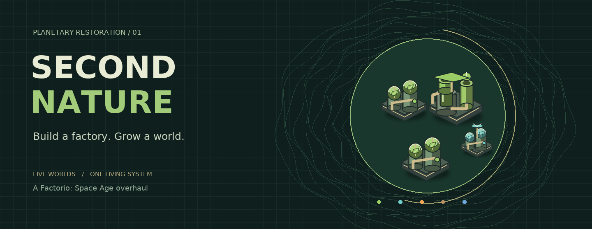

# Second Nature
### A planetary-restoration overhaul for Factorio: Space Age

**The next megaproject is not an escape route. It is a living world.**

Restore five planets through a real industrial economy: pioneer cultures, engineered soils, atmospheric treatment, watersheds, clean chemistry, closed waste loops and interplanetary biodiversity. Borrow from the future with dirty shortcuts—or build a factory that can sustain its home. Native broods resist ecological change even as your pollution falls.

**v0.1.0 alpha · 22 machines · 88 recipes · 20 technologies · 3 new sciences · 5 planetary campaigns**

> **Verification, not hype:** 109 automated tests pass. The complete data-stage scripts run against Wube's **2.0.77** and **2.1.17** source definitions in Lua 5.2, in both progression modes. **Factorio's actual engine, graphical client, multiplayer synchronization and a full campaign have not been playtested here.** The official binary download is blocked in this environment. An opt-in real-engine smoke test is included; this is an alpha to test on a fresh save, not a certified production release.

## Install

Choose **one** archive matching your game branch:

| Factorio branch | Installable build |
|---|---|
| **2.1.17 experimental** — newest release checked | [Download Second Nature for 2.1](https://github.com/Radukan/FC-Test/releases/download/v0.1.0-factorio-2.1/second-nature_0.1.0.zip) |
| **2.0.77 stable** | [Download Second Nature for 2.0](https://github.com/Radukan/FC-Test/releases/download/v0.1.0-factorio-2.0/second-nature_0.1.0.zip) |

Installable ZIPs and SHA-256 checksums are hosted on [GitHub Releases](https://github.com/Radukan/FC-Test/releases), not committed as generated binaries. Each Factorio branch has a separate alpha prerelease so both downloads retain the required `second-nature_0.1.0.zip` filename. **While the repository is private, sign in to GitHub with an account that has repository access to download.** Do not use GitHub's automatically generated “Source code” archives as installable mods.

To build from a checkout, run `python3 tools/package.py` (Python 3.11+, no extra packages needed), or use the `second-nature/` source folder directly with Factorio 2.0.77.

1. Put the chosen archive, **still zipped**, in your Factorio `mods` directory. Do not install both builds together.
2. Enable **Space Age**, **Quality**, **Elevated Rails**, and **Second Nature**.
3. Start a **new Space Age freeplay** game. Default settings are the intended campaign.
4. Press **Shift + T** or click the leaf shortcut for the planetary dashboard and field guide.

Mod directories: Windows `%APPDATA%\Factorio\mods`; Linux `~/.factorio/mods`; macOS `~/Library/Application Support/factorio/mods`.

## The campaign

| World | Restoration problem | Signature industry | What stays dangerous |
|---|---|---|---|
| **Nauvis** | Fragmented soils and a polluted atmosphere | Pioneer biology, forests and clean chemistry | Biters attack ecological change, not just emissions |
| **Vulcanus** | Extreme heat, unstable air, little viable water | Basalt weathering and thermophile cultures | Lava and demolisher territories are untouched |
| **Fulgora** | Legacy heavy metals and thin, dry soils | Scrap remediation and holmium biocatalysts | Lightning, islands and oil oceans remain |
| **Gleba** | Invasive dominance rather than stable symbiosis | Spore balancing and sheltered agriculture | Spoilage, fertile-soil logistics and pentapods remain |
| **Aquilo** | Cold, fragile water cycles and imported biology | Heated cryogenic gardens | Heat pipes, ice support and interplanetary supplies remain essential |

Each world has five **0–100 fitness axes**: atmosphere, thermal balance, water cycle, living soil and biodiversity. **Toxicity** constrains recovery. **Native resistance** responds to ecological change. Six stages take a planet from **Hostile** to **Self-sustaining**.

### Production earns recovery

- A placed or powered-but-idle machine earns **nothing**. Only completed recipes count.
- Biodiversity cannot outgrow its supporting atmosphere, heat, water and soil. The dashboard exposes its exact ceiling.
- Scrubbers remove real local pollution/spores, while capturing spent cartridges that need processing. Ordinary pollution is enabled on Vulcanus, Fulgora and Aquilo too; Gleba keeps its native spores.
- Dirty retorts and forcing stacks are fast and economical up front, but create sludge and measurable toxic debt.
- Established ecosystems unlock efficient cultivation and late-game research through actual **surface conditions**.
- Recovery gently regresses without maintenance; mature worlds are more resilient. Untouched worlds do not decay off-screen.

### Close the loops

```text
Stone + iron + water → pioneer culture + mineral feed → algae
                                                       ↓
                           compost + biofilm + biochar → living soil
                                                       ↓
                         restored ecosystems → samples → ecology science

Biochar → carbon filters → scrubbers / clean water → spent filters
               ↑                                        ↓
               └────────── reclamation ←────────────────┘
                                ↓
                       contaminated effluent
                                ↓
                   water + sludge → vitrified aggregate → concrete

Thermal buffers → climate work → depleted buffers → powered recharge

Vulcanus thermophiles + Fulgoran catalysts + Gleban symbionts
                                ↓
                       biodiversity matrices
                                ↓
                   sanctuaries + Aquilo gardens
                                ↓
                        Gaia beacon network
```

### Clean does not mean safe

On **Nauvis and Gleba**, rapid restoration can provoke native organisms even with little pollution. Scripted responses require a **real existing nest 96–512 tiles away**, give **45 seconds of warning**, and target restoration installations. Balanced mode has a **20-minute local grace period**, **8-minute cooldown**, **40-unit cap** with smaller pentapod groups, and at most three tracked waves per world.

Clear the perimeter, defend your installations, or supply pheromone dampeners. No nearby nests means no scripted waves. Peaceful mode is respected. Other planets do **not** get arbitrary biter invasions.

### Win by sustaining, not just building

Research **Second Nature**, bring **all five worlds to stage 5**, and sustain your force's beacon network for **10 uninterrupted game minutes**:

- Every fitness axis **≥ 90** on every world.
- Toxicity **≤ 8** on every world.
- At least one of **your force's** beacons on every world must complete a real production cycle at least every **90 seconds**.

A broken condition resets the timer. After victory, keep building and research repeatable ecological lab productivity. In standard freeplay, this goal replaces the escape victory while the corresponding setting is enabled.

## First hour: the critical path

1. **Stone → silica → glass.** Silica is hand-craftable; glass is smelted. Red science now consumes one glass. The separate silica feedstock avoids the stone-brick furnace ambiguity.
2. **Pioneer biology.** Power a bioreactor and supply water. Make mineral nutrients and pioneer culture, then algae. No irreplaceable starter culture, tree or seed is required.
3. **The living substrate.** Compost algae and produce biochar. Green science now needs compost. Make living soil substrate.
4. **Field ecology.** Supply a soil restoration station. Turn its ecological samples into ecology science; feed ordinary labs.
5. **Atmosphere → water → forests.** Add scrubbers and water treatment, then watersheds and seed dispersers. Buffer early waste until closed-loop technology is available.
6. **Nothing left behind.** Reclaim filters, recharge thermal buffers, treat effluent, vitrify sludge, and use the aggregate in concrete before scaling planetary work.

Need help? The in-game field guide covers startup, waste loops, resistance, planetary specialties, circuit examples and the endgame. Full recipes are also in the [catalog](docs/CATALOG.md).

## Controls and customization

| Control | Purpose |
|---|---|
| **Shift + T**, leaf shortcut, `/second-nature` | Open the field station |
| **Ecology circuit monitor** | Wire 0–100 fitness/toxicity/resistance/stability and 0–5 stage signals into factory control |
| `/sn-status` | Read-only status report, including headless consoles |
| `/sn-reindex` | Administrator-only machine rescan; preserves ecological progress |

Startup: toggle vanilla progression integration. Runtime: restoration speed, resistance difficulty, local grace period, safe terrain recovery, sparse tree growth and network victory. The monitor's **first section is reserved** for telemetry; it never shares a named logistic group across worlds.

## Compatibility and safety

- New Space Age freeplay saves are the intended starting point. Back up existing saves before adding an overhaul.
- Vanilla logistics, space travel, quality and planetary hazards remain. This overhauls **the campaign objective, ecological economy and research progression**, not every belt and assembler recipe.
- Other major overhauls, alternative starting planets/victory scenarios and custom planets are **not tested integrations**. Unknown surfaces/platforms never receive a planetary ecology state.
- Terrain recovery is local and conservative. Never rewrites lava, oil seas, crop soils, ice, foundations, resources, ghosts, cliffs or player paving. Aquilo uses sheltered garden overlays, not melting support tiles.
- Art includes **original icons, research illustrations and garden overlays**; world machines deliberately reuse tinted installed Factorio animations and sounds. There is no claim of a complete custom animation set.
- **Before uninstalling:** disable **Network victory**, save, then remove the mod. This restores the previous stock Space Age end setting. Removal can still delete modded items and machines; terrain changes already made are not rolled back.

## Project guide

- [Design & progression](docs/DESIGN.md)
- [All machines, recipes, research and materials](docs/CATALOG.md)
- [Balance equations & rate budgets](docs/BALANCE.md)
- [Reference-kit simulation results](docs/SIMULATION.md)
- [Development, API and testing](docs/DEVELOPING.md)
- [Verification ledger & release checklist](docs/VERIFICATION.md)
- [Packaged player guide](second-nature/README.md)

```bash
python3 -m pip install -r requirements-dev.txt
python3 -m pytest -q               # source-data tests need the pinned upstream checkouts
python3 tools/package.py           # builds both branch-specific archives
```

**MIT** for original code and generated art. Factorio and Space Age are Wube Software's games; installed proprietary assets are referenced, not redistributed. Planet Crafter is a design inspiration, not an asset source or affiliation.
